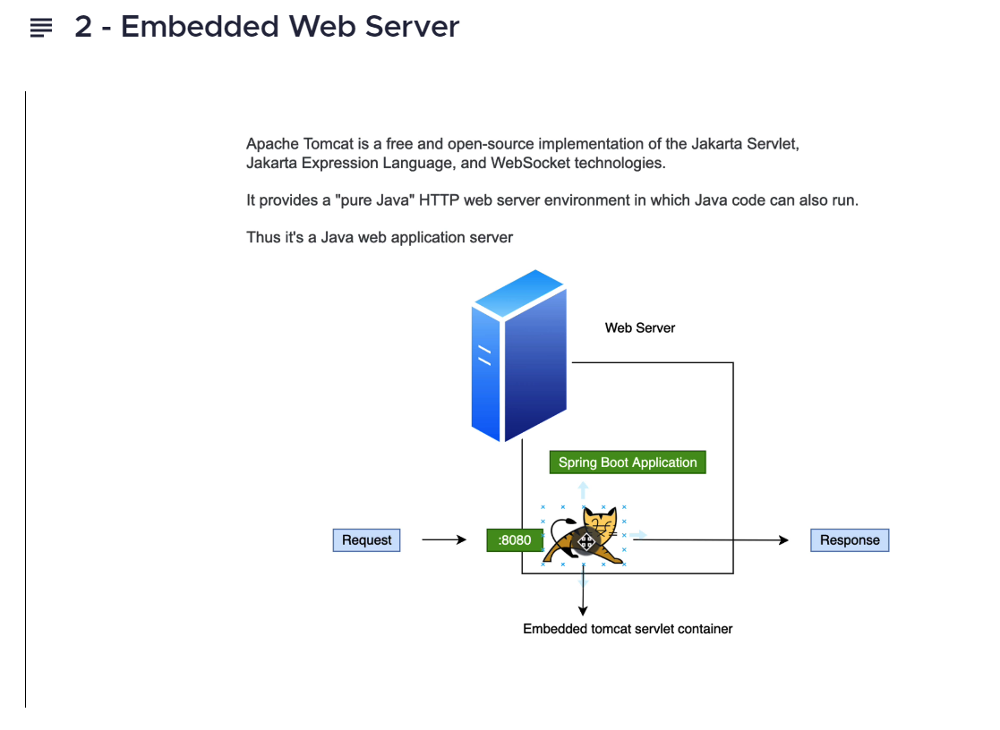

# Rest-Api-Using-SpringBoot3
I am building a Rest API using SpringBoot3, testing it, securing it, connecting it to a real database and deploying it to the cloud.

# Tools
Maven > install maven > verify installation mvn -v 
SpringBoot3
JDK > Java Development Kit 17^

# Java Embedded Web Servers
Java Embedded Web Servers are lightweight web servers that can be embedded in a Java application.
These servers provide a convenient way to develop, test,
and deploy web applications without the need for a separate web server installation.
In this context, Tomcat, Jetty, and Undertow are popular Java Embedded Web Servers.

Apache Tomcat is an open-source web server that is widely used for Java web application development.
Tomcat supports servlets and JavaServer Pages (JSPs), and it provides a simple and lightweight HTTP server.
Tomcat is easy to set up and configure, and it supports a range of advanced features such as SSL,
virtual hosting, and clustering.

Jetty is another popular open-source web server and servlet container for Java applications.
Jetty is designed to be lightweight and fast, and it provides a modular architecture that
allows users to customize the server as per their requirements.
Jetty supports WebSocket, SPDY, and HTTP/2 protocols and is commonly used in embedded applications,
such as IoT devices and mobile applications.

Undertow is a relatively new web server designed to be lightweight and flexible.
It is also a component of the popular WildFly application server.
Undertow supports both blocking and non-blocking I/O, and it provides
an embedded Servlet container for web application deployment.
Undertow is easy to configure and provides excellent performance even for high-traffic websites.

In summary, Tomcat, Jetty, and Undertow are all popular Java Embedded Web Servers that provide lightweight
and easy-to-use HTTP server capabilities for web application development.
Each server has its own strengths and features, making them suitable
for different use cases and application requirements.

#Steps
create a maven/springboot3 project with spring initializr

